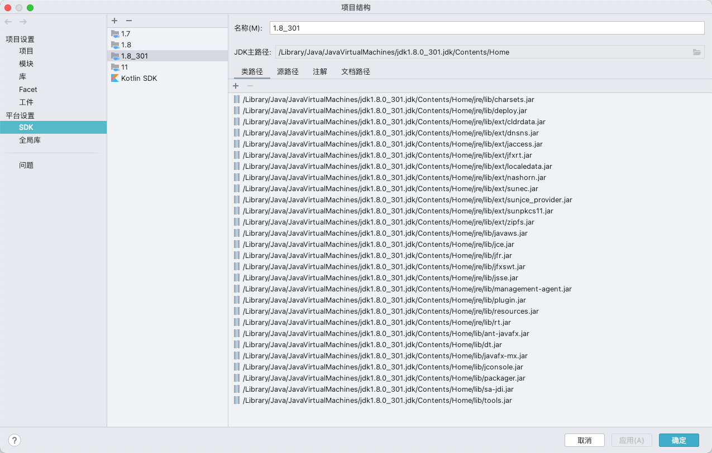
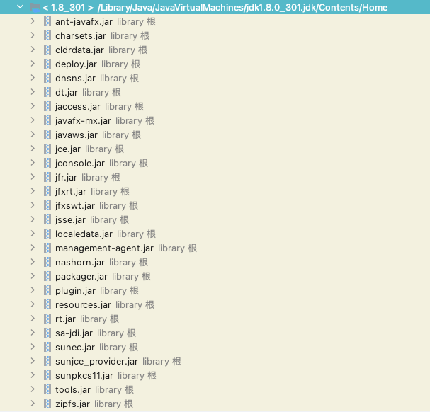

[JDK源码阅读项目搭建之记录](https://blog.csdn.net/Mr_Programming_Liu/article/details/105158350)

jdk 版本：1.8.0-301

四大包，lang，io，net，util包源码

rt.jar  sun.misc 包下的代码

https://github.com/openjdk/jdk/blob/jdk8-b120/jdk/src/share/classes/sun/misc/ProxyGenerator.java

sun.misc 包下有些代码会不匹配：SharedSecrets.getJavaOISAccess() 方法 openjdk 中该类下没有

# 依赖
- org.projectlombok:lombok:1.18.10
- ch.qos.logback:logback-classic:1.2.3

# jdk 源码包

